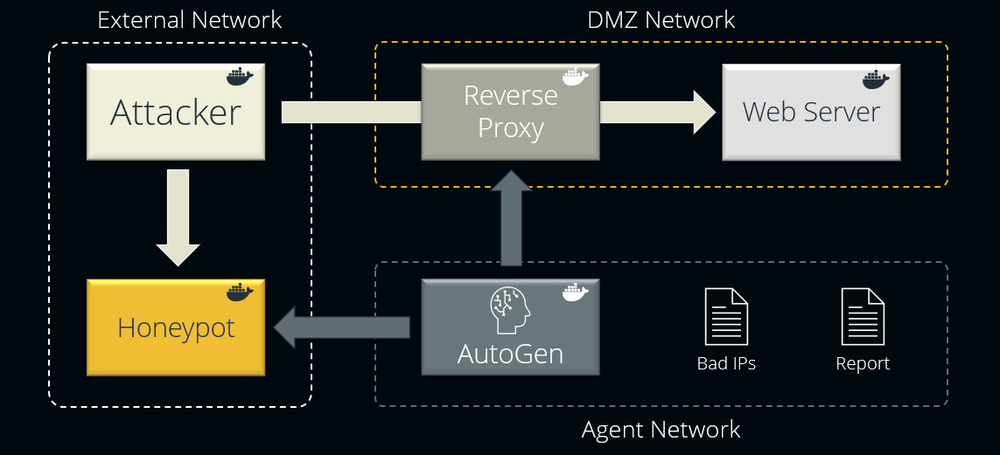
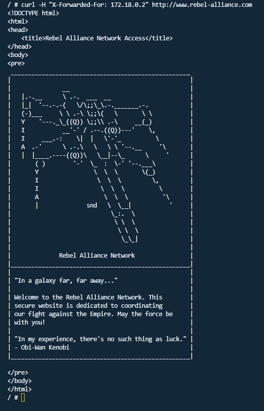

# HoneyAgents: AI-Powered Honeypot Defence System

## Introduction
HoneyAgents is a proof-of-concept web app defence system that utilises autonomous AI agents to detect and mitigate cyber threats. By integrating honeypots with an autonomous AI agent, HoneyAgents highlights the potential for a new level of proactive security, providing high-fidelity threat intelligence and real-time defensive actions using the power of LLMs (Large Language Models).


## Table of Contents
- [Core Concept](#core-concept)
- [Features](#features)
- [Requirements](#requirements)
- [Getting Started](#getting-started)
- [Installation](#installation)
- [Configuration](#configuration)
- [Usage](#usage)
- [Contributing](#contributing)
- [Acknowledgements](#acknowledgements)
- [License](#license)

## Core Concept
At the heart of HoneyAgents is the integration of [AutoGen](https://github.com/microsoft/autogen), a framework that enables the development of sophisticated LLM applications through multi-agent conversations. These agents can communicate, orchestrate complex tasks, and involve human input seamlessly. With AutoGen, HoneyAgents can autonomously:

- Analyse honeypot logs to detect malicious activity.
- Update deny lists dynamically to block identified threats.
- Generate detailed threat intelligence reports of attackers' actions.

If you'd like a quick (<5 minutes) overview of the project and its capabilities then check out the [demo video](https://www.youtube.com/watch?v=xjQnWf3xWpU).

## Features

- **Intelligent Threat Detection**: Uses autonomous agents to gather detailed information on attack patterns observed during honeypot interactions.
- **Dynamic Deny List Updating**: Automatically updates and applies reverse proxy configurations to block identified attackers.
- **Real-Time Threat Intelligence Reporting**: Generates comprehensive reports detailing the nature and extent of the threats encountered, as well as any actions taken to mitigate them.

## Requirements
- Docker & Docker Compose
- Python 3.x
- OpenAI API Key

### Recommended Testing Environment
This project was built and tested on an Ubuntu 23.10 x64 virtual machine hosted by DigitalOcean. If you don't have an existing environment set up, consider using DigitalOcean for a seamless experience. Use the following referral link to get started with $200 in free credits: [https://m.do.co/c/bdda01639ce6](https://m.do.co/c/bdda01639ce6).

Please note that while HoneyAgents should work on various environments, the steps and results you encounter may vary if you use a different setup than the one recommended.

## Getting Started
To quickly get started with HoneyAgents, run the following commands:
```sh
git clone https://github.com/mrwadams/honeyagents.git
cd honeyagents
cp .env.example .env
# Edit .env to add your OpenAI API key
docker-compose up --build -d
```

## Installation
1. Clone the repository.
2. Create a `.env` file with the necessary environment variables. See `.env.example` for an example.
3. Execute `docker-compose up --build`.

## Configuration
The Docker Compose file outlines services such as Attacker Simulation, Honeypot, Reverse Proxy, Web Server, and AutoGen Agent. Networks are predefined for segregation and security.



## Usage

While HoneyAgents is capable of fully autonomous operation, it's configured so that users can interact with the system to explore its capabilities and trigger specific behaviours. Follow these steps to get the most out of HoneyAgents:

1. **Web Server Accessibility Check**: Start an interactive session on the Attacker container by running the following command:

   ```sh
   docker exec -it attacker /bin/sh
   ```

   From the Attacker container, verify that the web server is accessible. Use the following command, which includes an `X-Forwarded-For` header to ensure the source IP is visible to the reverse proxy:

   ```sh
   curl -H "X-Forwarded-For: 172.18.0.2" http://www.rebel-alliance.com
   ```
   Note: The `X-Forwarded-For` header is essential because Docker's NAT routing would otherwise prevent the reverse proxy from seeing the true source IP of the request.

   If the request is successful, the web server will return the HTML code for the target website.

   

2. **Honeypot Interaction**: Next, we will simulate an attacker interacting with the honeypot by SSH'ing into it from the Attacker container. Without exiting the Attacker container, run the following command to access the Honeypot:
   ```sh
   ssh -p 2222 172.18.0.3
   ```
   Accept the SSH fingerprint prompt by typing `yes` and pressing `Enter`. The honeypot will then prompt you for a password. 
   
   Enter anything you like for the password and press `Enter` to log in.

   Feel free to explore the machine. To give the agent something to think about, create a file called malware.sh by running the following command:
   ```sh
   touch malware.sh
   ```

   When finished, log out from the Honeypot by typing `exit`.

   Type `exit` once more to return to the host machine.

3. **Agent Activation**: Trigger the autonomous agent to review the honeypot logs and set up deny rules against detected malicious IPs. Execute the `run_agent.sh` script in the root of the `honeyagents` directory.
   ```sh
   . run_agent.sh
   ```
   Monitor the console output to follow the agent's actions.

4. **Deny Rule Verification**: After the agent has updated the deny list, attempt to access the web server from the attacker container once more:
   ```sh
   curl -H "X-Forwarded-For: 172.18.0.2" http://www.rebel-alliance.com
   ```
   You should now receive a `403 Forbidden` response from the reverse proxy, indicating that access has been successfully blocked.

5. **Threat Intelligence Report**: Finally, review the threat intelligence report generated by the agent. Access the report within the AutoGen container using:
   ```sh
   docker exec autogen cat /var/report.md
   ```
   The report contains a natural language write-up of the threats detected and the actions taken by the agent to mitigate them.

6. **Clean Up**: To reset the environment, run the `cleanup.sh` script in the root of the `honeyagents` directory.

   ```sh
   . cleanup.sh
   ```

By following the above steps, users can manually trigger and observe the threat detection, mitigation and reporting processes of the HoneyAgents system in action.

## Contributing
Pull requests are welcome. For major changes, please open an issue first to discuss what you would like to change.

## Acknowledgements
- [AutoGen](https://github.com/microsoft/autogen)

## License
This project is licensed under GNU GPLv3. See [LICENSE](LICENSE) for more details.